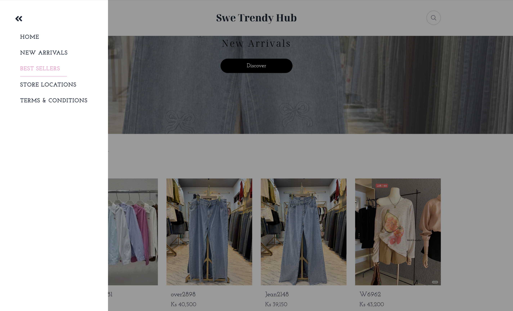

# Fashion Shop Landing

  

  
  
  
  
  

## Tech Stack

- **React 18** – UI library
- **Vite** – Build tool & dev server
- **TanStack Query** – Data fetching & caching
- **TailwindCSS** – Styling
- **TypeScript** – Type safety
